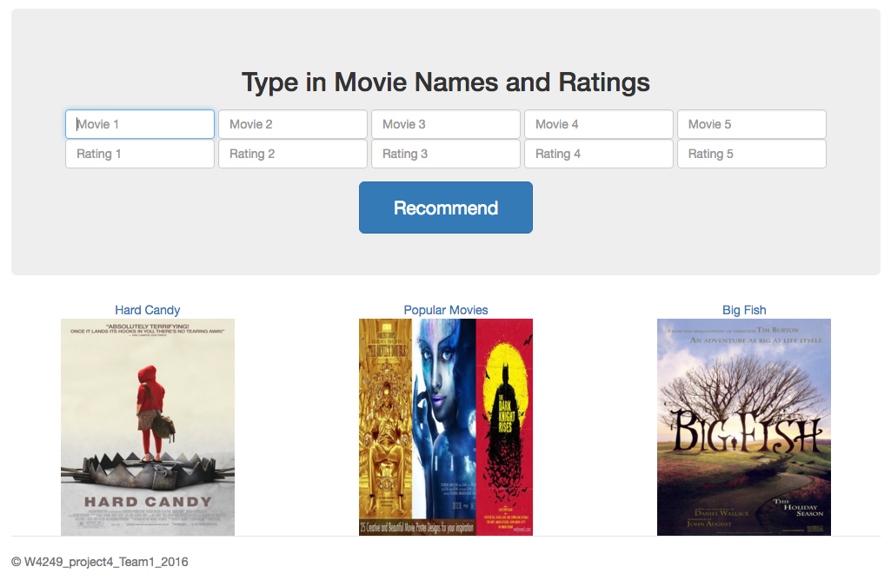

# Project 4 Collective intelligence
### Movie Recommender 

Term: Spring 2016

Group 1: Chenlu Ji, Arnold Chua Lau, Yueying Teng, Jingwei Li.

All members contributed equally to the project.

In this project, we used the Stanford [dataset](http://snap.stanford.edu/data/web-Movies.html) consisting of Amazon movie from Aug 1997 to Oct 2012 to build a movie recommendation system. We filtered the dataset to a smaller one by choosing users with more than 100 reviews and movies that has more than 100 reviews.

The recommendation system is users-based and it recommends the user three movies based on the movies feed to the system and their ratings entered. 

When new user enters the movie names and the corresponding ratings the recommender will look for the most similar users in the existing dataset by cosine similarity. This could be a collection of more than one similar existing users. If this is the case, the system will pick the top three movies from all the movies rated by this group of similar users. During the process, we used Amazon API to transform movie name to ASIN. At last, three movies will be returned by the system that are thought to suit the user’s taste well.

